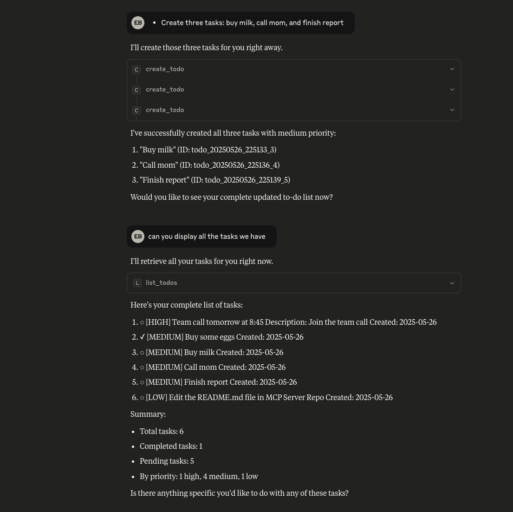
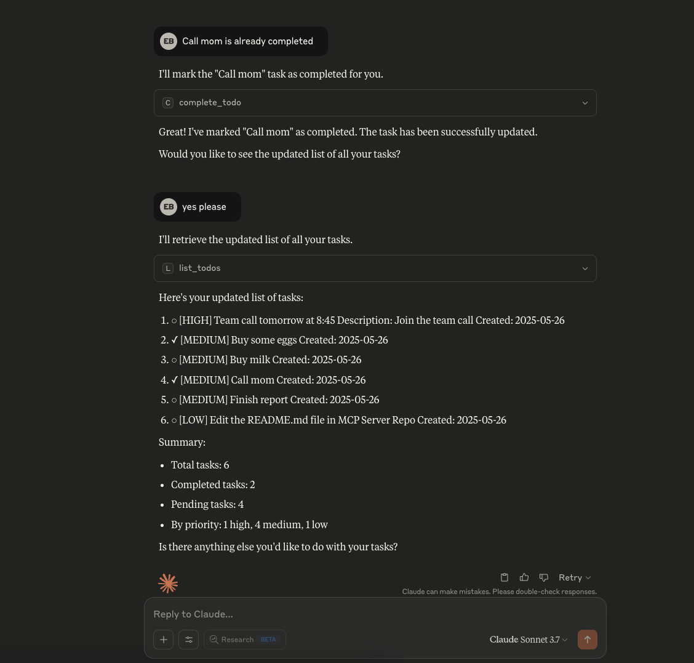

# Todo List MCP Server

A production-ready Model Context Protocol (MCP) server for managing todo lists. This server can be accessed via HTTP (SSE transport) for web integrations or stdio transport for Claude Desktop, enabling AI-powered task management through natural language.


## 🌟 What is MCP?

The Model Context Protocol (MCP) is an open protocol that enables seamless integration between AI models and external data sources or tools. It provides a standardised way for AI assistants to interact with your applications, databases, and services.

### SSE vs Stdio Transport

This server supports two transport methods:

1. **SSE (Server-Sent Events)**
   - Used for HTTP-based communication
   - Perfect for web applications, APIs, and cloud deployments
   - Allows remote access over network
   - Ideal for integrating with services like OpenAI

2. **Stdio (Standard Input/Output)**
   - Used for local inter-process communication
   - Required for Claude Desktop integration
   - More secure (local only)
   - Lower latency for local applications

## 🚀 Features

- **Full CRUD Operations**: Create, Read, Update, Delete todos
- **Natural Language Processing**: Interact using conversational commands
- **Priority Management**: Organize tasks by priority (high, medium, low)
- **Smart Filtering**: View all, completed, or pending todos
- **Statistics Dashboard**: Get insights about your productivity
- **Persistent Storage**: Todos are saved locally in JSON format
- **Multi-Transport Support**: Both SSE (HTTP) and stdio modes
- **AI Integration Ready**: Works with Claude Desktop
- **Docker Support**: Ready for containerized deployment
- **Cloud Native**: Designed for Google Cloud Run and similar platforms

## 📋 Available MCP Tools

| Tool | Description | Example Usage |
|------|-------------|---------------|
| `create_todo` | Create a new todo with title, description, and priority | "Add a high priority task to review the budget" |
| `list_todos` | List todos with filtering options | "Show me all pending tasks" |
| `get_todo` | Get detailed information about a specific todo | "Get details of todo_20240115_143022_0" |
| `update_todo` | Update todo title, description, or priority | "Change the budget review priority to medium" |
| `complete_todo` | Mark a todo as completed | "Complete todo_20240115_143022_0" |
| `complete_todo_by_number` | Complete a todo by its position | "Complete the 2nd task" |
| `uncomplete_todo` | Mark a todo as pending | "Reopen the budget review task" |
| `delete_todo` | Delete a specific todo | "Delete todo_20240115_143022_0" |
| `clear_completed_todos` | Delete all completed todos | "Clear all completed tasks" |
| `get_todo_stats` | Get statistics about your todos | "Show me my productivity stats" |

## 🏃 Quick Start

### Prerequisites

- Python 3.8 or higher
- pip (Python package manager)
- Docker (optional, for containerized deployment)
- Claude Desktop (optional, for Claude integration)
- OpenAI API key (optional, for GPT-4.1 integration)

### Installation

1. **Clone the repository:**
```bash
git clone https://github.com/enesbasbug/ToDo-MCP-Server.git
cd ToDo-MCP-Server
```

2. **Create a virtual environment (recommended):**
```bash
python -m venv venv
source venv/bin/activate  # On Windows: venv\Scripts\activate
```

3. **Install dependencies:**
```bash
pip install -r requirements.txt
```

## 🖥️ Running Locally

### Option 1: SSE Mode (HTTP Server)

Use this mode for web applications, API access, or AI integrations:

```bash
python server.py
```

The server will start on `http://localhost:8050/sse`

**Test the SSE server:**
```bash
python client.py
```

- Outputs:
   ```
   Todo List MCP Client
   1. Run automated tests
   2. Interactive mode
   Select mode (1 or 2): X
   ```

   Choose mode 1 for automated tests or mode 2 for interactive mode.

### Option 2: Stdio Mode (Claude Desktop)

For Claude Desktop integration, see our detailed guide: [**Claude Desktop Setup Guide**](./CLAUDE_DESKTOP_SETUP.md)

Quick overview:
- Uses stdio transport for local communication
- Enables natural language todo management through Claude
- Requires configuration in Claude Desktop settings

#### See it in action:


<table>
  <tr>
    <td align="center">
      
      <br>
      <em>Creating todos naturally</em>
    </td>
    <td align="center">
      
      <br>
      <em>Managing your tasks</em>
    </td>
  </tr>
</table>

[**→ Full Claude Desktop Setup Instructions**](./CLAUDE_DESKTOP_SETUP.md)

### Option 3: Docker

```bash
# Build the image
docker build -t todo-mcp-server .

# Run with SSE mode
docker run -p 8050:8050 todo-mcp-server

# Run with persistent storage
docker run -p 8050:8050 -v $(pwd)/todos_data:/app/data todo-mcp-server
```

## 🤖 AI Integrations

### OpenAI GPT-4.1 Integration

This server can be integrated with OpenAI's GPT-4.1 to enable natural language todo management:

1. **Set up your OpenAI API key:**
   ```bash
   # Create .env file
   echo "OPENAI_API_KEY=your-api-key-here" > .env
   ```

2. **Run the OpenAI client:**
   ```bash
   python openai_client.py
   ```

3. **Interact naturally:**
   ```
   You: I need to prepare for tomorrow's team meeting and review the Q3 reports
   Assistant: I'll help you organize these tasks. Let me create them for you...
   [Creates two todos with appropriate priorities]
   
   You: What's on my plate for today?
   Assistant: Here are your pending tasks for today:
   1. [HIGH] Review Q3 reports
   2. [HIGH] Prepare for team meeting
   3. [MEDIUM] Update project documentation
   
   You: I finished reviewing the reports
   Assistant: Great! I'll mark the Q3 reports review as completed.
   ```

### How It Works with LLMs

1. **Natural Language Understanding**: The LLM interprets your intent
2. **Tool Selection**: It chooses the appropriate MCP tool
3. **Parameter Extraction**: Extracts necessary information from your message
4. **Action Execution**: Calls the MCP server to perform the action
5. **Response Generation**: Provides a human-friendly response

### Benefits of LLM Integration

- **No Commands to Remember**: Just speak naturally
- **Context Awareness**: The AI remembers your conversation (For the local one only (Claude Desktop), for now.)
- **Smart Suggestions**: Get intelligent task prioritization
- **Bulk Operations**: Handle multiple tasks in one request

## ☁️ Cloud Deployment

### Google Cloud Run

1. **Prepare for deployment:**
   ```bash
   # Update deploy.sh with your project ID
   chmod +x deploy.sh
   ./deploy.sh
   ```
2. **Update your client URLs**

   After deployment, you'll receive a URL like:
   ```https://todo-mcp-server-xxxxx-uc.a.run.app```

   You **MUST** update **all** client code to use this URL:
   ```python
   # ❌ OLD (localhost)
   client = TodoMCPClient("http://localhost:8050/sse")

   # ✅ NEW (Cloud Run URL)
   client = TodoMCPClient("https://todo-mcp-server-xxxxx-uc.a.run.app/sse")
   ```

## 🔧 Configuration

### Environment Variables

| Variable | Description | Default | Required For |
|----------|-------------|---------|--------------|
| `PORT` | Server port for SSE mode | `8050` | Cloud Run |
| `TODOS_FILE` | Path to store todos | `todos.json` | All modes |
| `OPENAI_API_KEY` | OpenAI API key | None | OpenAI integration |


## 🔄 Post-Deployment Configuration (if you deployed)

### Updating Client URLs

When you move from local development to cloud deployment, remember to update ALL client connections:

| File | Local URL | Cloud URL |
|------|-----------|-----------|
| `openai_client.py` | `http://localhost:8050/sse` | `https://your-service.run.app/sse` |
| `client.py` | `http://localhost:8050/sse` | `https://your-service.run.app/sse` |
| Custom scripts | `http://localhost:8050/sse` | `https://your-service.run.app/sse` |


**Pro tip:** Use environment variables for URLs:
```python
import os
MCP_URL = os.environ.get('MCP_SERVER_URL', 'http://localhost:8050/sse')
client = TodoMCPClient(MCP_URL)
```

## 💾 Data Storage

### Current Implementation
This server uses **JSON file storage** for simplicity and portability. While not suitable for production use with multiple users or high-volume operations, it's perfect for:
- Learning and experimenting with MCP
- Personal todo management
- Small team deployments
- Proof of concept implementations

### Storage Locations
- **SSE Mode**: `todos.json` in the current directory
- **Stdio Mode**: `~/todo_mcp_data.json` in home directory
- **Docker**: Configurable via volume mounts

### Production Considerations
For production deployments, consider:
- **SQLite**: For single-user applications
- **PostgreSQL/MySQL**: For multi-user applications
- **Cloud Firestore**: For serverless deployments
- **Redis**: For high-performance caching

The modular design makes it easy to swap the storage backend without changing the MCP interface.

## 📚 Usage Examples

### Direct API Usage (Python)

```python
import asyncio
from mcp import ClientSession
from mcp.client.sse import sse_client

async def manage_todos():
    async with sse_client("http://localhost:8050/sse") as (read, write):
        async with ClientSession(read, write) as session:
            await session.initialize()
            
            # Create a todo
            result = await session.call_tool(
                "create_todo",
                arguments={
                    "title": "Review project proposal",
                    "description": "Review and provide feedback on Q1 project proposal",
                    "priority": "high"
                }
            )
            print(result.content[0].text)
            
            # List all todos
            result = await session.call_tool("list_todos")
            print(result.content[0].text)

asyncio.run(manage_todos())
```

### Natural Language Examples

With Claude Desktop or other apps support MCP:

```
"I need to finish three things today: email the client, update the budget spreadsheet, and call the vendor"
→ Creates 3 todos with appropriate details

"Show me what I haven't finished yet"
→ Lists all pending todos

"The client email is done"
→ Marks the email task as completed

"What's my highest priority right now?"
→ Shows high priority pending tasks
```

## 🏗️ Architecture

Two transport modes available:
- **SSE Mode** (`server.py`): For HTTP/API access, Docker, and cloud deployment
- **Stdio Mode** (`server_stdio.py`): For Claude Desktop ([setup guide](./CLAUDE_DESKTOP_SETUP.md))

```
┌─────────────────┐                    ┌─────────────────┐
│  Claude Desktop │                    │   Web Client    │
│  (Natural Lang) │                    │   (Direct API)  │
└────────┬────────┘                    └────────┬────────┘
         │                                      │
         │ Stdio                                │ HTTP/SSE
         │                                      │
┌────────▼────────┐                    ┌────────▼────────┐
│ server_stdio.py │                    │    server.py    │
│  (Local Only)   │                    │  (Network Ready)│
└────────┬────────┘                    └────────┬────────┘
         │                                      │
         └──────────────┬───────────────────────┘
                        │
                        ▼
                 ┌─────────────┐
                 │  todos.json │
                 │   Storage   │
                 └─────────────┘
```


## 📊 Monitoring & Logging

- ### Local Development
   - Logs are output to the console with timestamps and severity levels.


## 🚨 Troubleshooting

### SSE Server Issues

1. **Port already in use:**
   ```bash
   lsof -i :8050  # Find process using port
   kill -9 <PID>  # Kill the process
   ```

2. **Connection refused:**
   - Check if server is running: `ps aux | grep server.py`
   - Verify firewall settings
   - Ensure correct URL format: `http://localhost:8050/sse`

### Claude Desktop Issues

1. **Server not appearing:**
   - Verify JSON syntax in config file
   - Use absolute paths
   - Restart Claude Desktop

2. **Tools not working:**
   - Check Python path: `which python`
   - Verify MCP installation: `pip show mcp`

### OpenAI Integration Issues

1. **API key errors:**
   - Verify .env file exists
   - Check API key validity
   - Ensure sufficient API credits

2. **Tool execution failures:**
   - Check server is running
   - Verify network connectivity
   - Review error logs

## 🤝 Contributing

We welcome contributions! Please see our contributing guidelines:

1. Fork the repository
2. Create a feature branch (`git checkout -b feature/amazing-feature`)
3. Commit your changes (`git commit -m 'Add amazing feature'`)
4. Push to the branch (`git push origin feature/amazing-feature`)
5. Open a Pull Request

## 📄 License

This project is licensed under the MIT License - see the [LICENSE](LICENSE) file for details.

## 🙏 Acknowledgments

- Built with [Model Context Protocol](https://modelcontextprotocol.io)
- Powered by [FastMCP](https://github.com/modelcontextprotocol/python-sdk)
- AI integrations via [OpenAI](https://openai.com) and [Anthropic Claude](https://anthropic.com)


